# Portfolio | Desarrollador Full Stack

## Raúl González Gómez

**Desarrollador Full Stack Junior**  

---

## Sobre mí

Soy un desarrollador Full Stack Junior con experiencia en tecnologías como HTML, CSS, JavaScript, Node.js, PHP, JAVA y bases de datos como SQL. Me encanta construir aplicaciones que resuelvan problemas reales y trabajar en equipos colaborativos.

---

## Habilidades

| Tecnología     | Nivel         | Imagen                         |
|----------------|---------------|--------------------------------|
| HTML           | Medio/Alto    | 
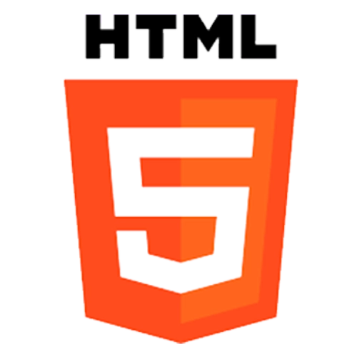
             |
| CSS            | Medio/Alto    | 
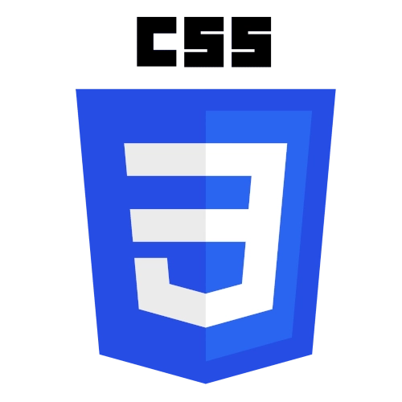
              |
| JavaScript     | Medio/Alto    | 

       |
| Tailwind CSS   | Medio/Alto    | 
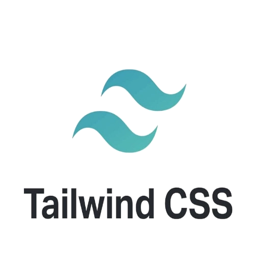
         |
| Bootstrap      | Medio         | 
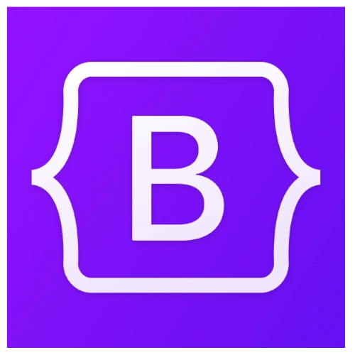
       |
| Node.js        | Básico/Medio  | 
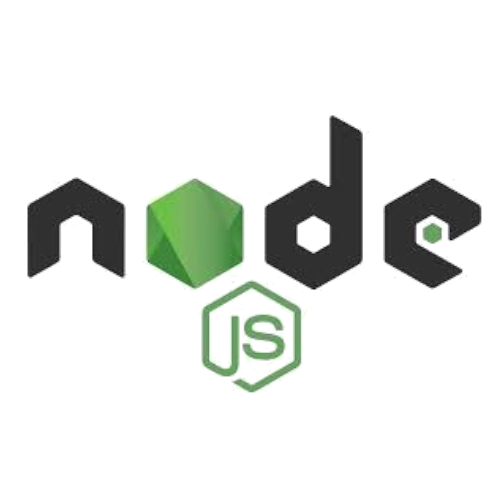
             |
| Git            | Básico        | 
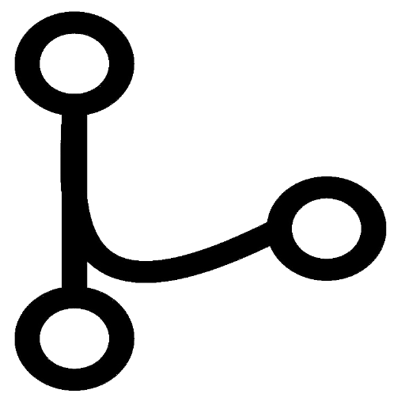
              |
| GitHub         | Básico/Medio  | 
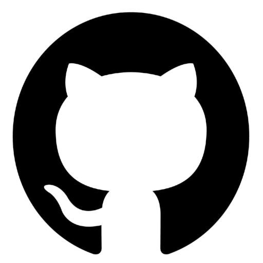
           |
| PHP            | Medio/Alto    | 

              |
| SQL            | Medio         | 
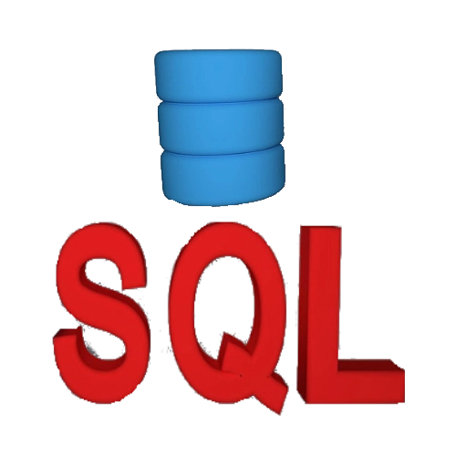
              |
| JAVA           | Medio         | 
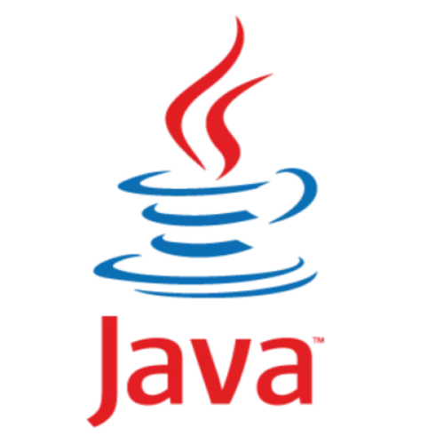
             |
| C              | Medio         | 

                |
| C++            | Medio         | 

              |

---

## Proyectos destacados

### [LandPage Feria Alcalá](https://raul-gon.github.io/WebFeria/)
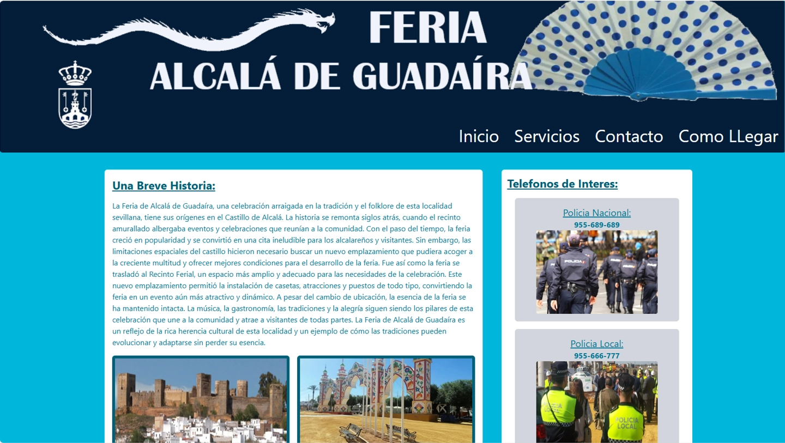 
LandPage de la Feria de Alcalá de Guadaíra con historia, teléfonos de interés y curiosidades.  
_Tecnologías: HTML, Tailwind CSS_

---

### [Web PHP Michael](https://raulphpmichael.ct.ws/)
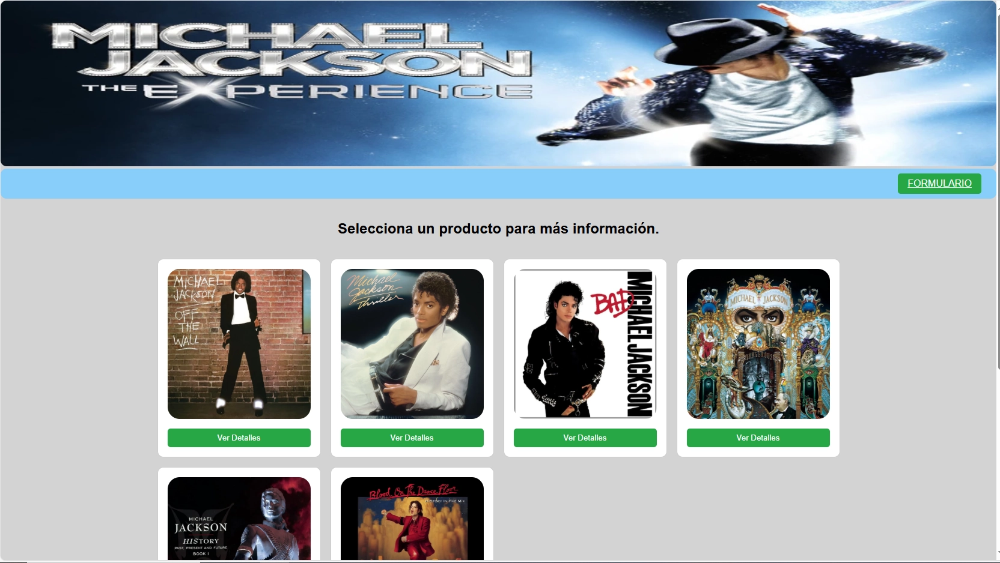 
Web de discos de Michael Jackson.  
_Tecnologías: HTML, CSS, JS, PHP, MySQL_

---

### [Web PHP Moda Flamenca](https://raulphpflamenca.ct.ws)
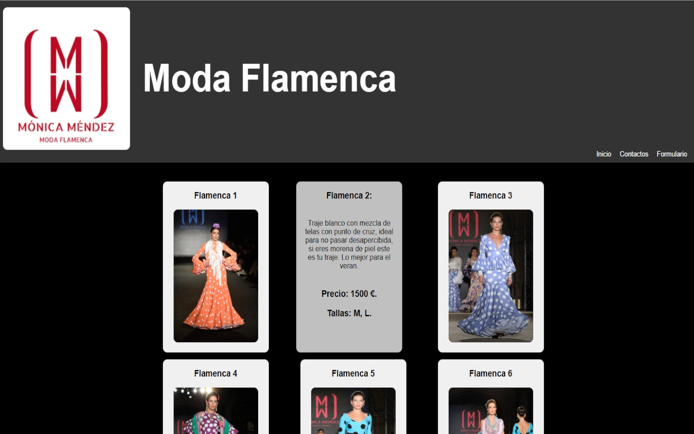 
Sitio de Moda Flamenca.  
_Tecnologías: HTML, CSS, PHP, MySQL_

---

### [Dashboard Chart.js](https://raul-gon.github.io/chart/)
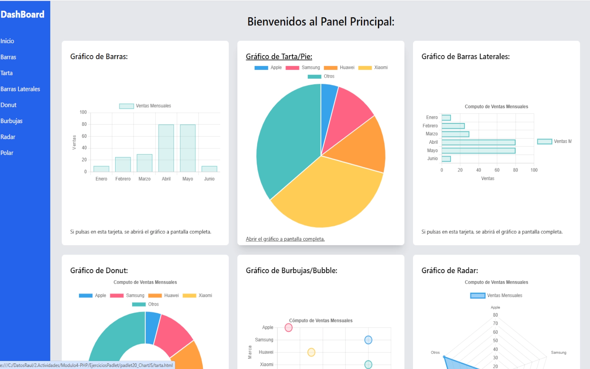 
Dashboard de gráficos con Chart.js.  
_Tecnologías: HTML, JS, Tailwind CSS_

---

## Contacto

_¡Estoy disponible para nuevas oportunidades!_

---

© 2025 Raúl González Gómez — Todos los derechos reservados.

