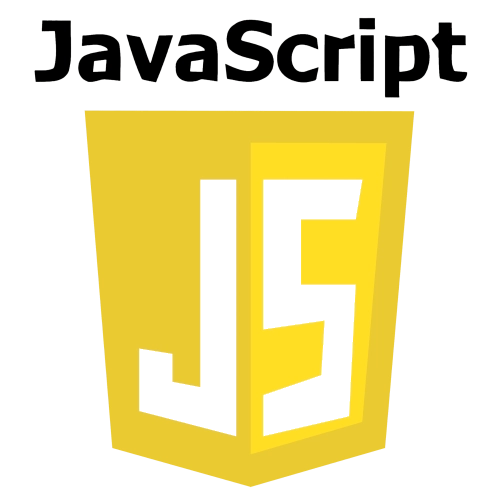

# Portfolio | Desarrollador Full Stack

## Raúl González Gómez

**Desarrollador Full Stack Junior**  

---

## Sobre mí

Soy un desarrollador Full Stack Junior con experiencia en tecnologías como HTML, CSS, JavaScript, Node.js, PHP, JAVA y bases de datos como SQL. Me encanta construir aplicaciones que resuelvan problemas reales y trabajar en equipos colaborativos.

---

## Habilidades

| Tecnología     | Nivel         | Imagen                         |
|----------------|---------------|--------------------------------|
| HTML           | Medio/Alto    |              |
| CSS            | Medio/Alto    |               |
| JavaScript     | Medio/Alto    |        |
| Tailwind CSS   | Medio/Alto    |          |
| Bootstrap      | Medio         |        |
| Node.js        | Básico/Medio  |              |
| Git            | Básico        |               |
| GitHub         | Básico/Medio  |            |
| PHP            | Medio/Alto    |               |
| SQL            | Medio         |               |
| JAVA           | Medio         |              |
| C              | Medio         |                 |
| C++            | Medio         |               |

---

## Proyectos destacados

### [LandPage Feria Alcalá](https://raul-gon.github.io/WebFeria/)

LandPage de la Feria de Alcalá de Guadaíra con historia, teléfonos de interés y curiosidades.  
_Tecnologías: HTML, Tailwind CSS_

---

### [Web PHP Michael](https://raulphpmichael.ct.ws/)

Web de discos de Michael Jackson.  
_Tecnologías: HTML, CSS, JS, PHP, MySQL_

---

### [Web PHP Moda Flamenca](https://raulphpflamenca.ct.ws)

Sitio de Moda Flamenca.  
_Tecnologías: HTML, CSS, PHP, MySQL_

---

### [Dashboard Chart.js](https://raul-gon.github.io/chart/)

Dashboard de gráficos con Chart.js.  
_Tecnologías: HTML, JS, Tailwind CSS_

---

## Contacto

- 
- 
- 
- 
- 

_¡Estoy disponible para nuevas oportunidades!_

---

© 2025 Raúl González Gómez — Todos los derechos reservados.
